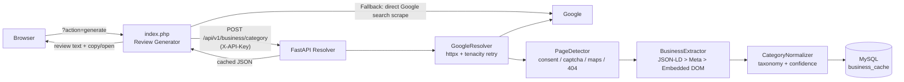

# Google Business Profile Resolver & Review Generator

A two-part system for resolving **Google Business Profile** URLs and generating ready-to-paste Google reviews:

| Component | Tech | Purpose |
|---|---|---|
| **Resolver API** (`app/`) | Python 3.12 / FastAPI | Resolves `g.page` / Google Maps review URLs via static HTTP + HTML parsing, extracts business data, normalizes the business category, and caches results in **MySQL**. |
| **Review Generator** (`index.php`) | PHP (single file) | Tailwind-styled web UI that picks a business, calls the Resolver API to auto-detect its category, and generates a random short/medium/long review from a large template library — then copies it and opens the business's Google review page. |

The service operates **without** browser automation (no Playwright/Selenium) and without paid Google APIs. It relies entirely on standard HTTP requests, redirect following, and static HTML parsing.

---

## Architecture



### Request lifecycle (FastAPI)

1. **Validation** – URL is checked for scheme/host against an allowlist (`g.page`, `google.com`, `www.google.com`, `maps.google.com`) → SSRF-safe.
2. **Single-flight lock** – concurrent requests for the same URL share one resolution (per-process `asyncio.Lock`).
3. **Cache lookup** – SHA-256 of the validated URL is looked up in the MySQL `business_cache` table; hits within TTL are returned instantly.
4. **Resolve** – `httpx` follows redirects with a browser-like User-Agent; transient failures retry with exponential backoff (`tenacity`).
5. **Page detection** – classifies the final page: Maps business, consent wall, captcha/sorry challenge, 404, or unknown.
6. **Extraction** – priority chain: **JSON-LD → OpenGraph/meta tags → embedded DOM signals** (`h1`, address/phone/website buttons, category button).
7. **Category normalization** – raw Google category is mapped to a stable taxonomy (exact = 1.0, synonym = 0.95, partial regex = 0.85, no match = `null` — never guessed).
8. **Upsert cache** – result (success *or* error status) is written back to MySQL.

---

## Features

- **Async FastAPI** service with a shared pooled `httpx.AsyncClient` (lifespan-managed).
- **MySQL caching** via async SQLAlchemy 2.0 + `aiomysql`; tables auto-created at startup.
- **TTL cache** (default 7 days) keyed by a SHA-256 hash of the normalized URL — success *and* error statuses are cached.
- **Retry with exponential backoff** for timeouts/transient HTTP errors (`tenacity`).
- **Bulk endpoint** processing up to N URLs with bounded concurrency (`asyncio.Semaphore`), one DB session per task.
- **API-key auth** (`X-API-Key`, optional) + in-memory per-IP rate limiting (swap for Redis in multi-worker production).
- **Structured JSON logging** via `python-json-logger`.
- **Stable JSON error contract** so callers can branch on machine-readable codes.
- **PHP Review Generator UI** — business cards (from your registration DB or demo data), service auto-detection, review length selector, regenerate, one-click copy + open review link, and an on-screen scraper debug panel.

---

## Project structure

```
├── app/
│   ├── api/
│   │   ├── dependencies/       # auth.py (API key), rate_limit.py (token bucket)
│   │   └── routes/             # health.py, business.py
│   ├── core/
│   │   ├── config.py           # pydantic-settings (.env) incl. database_url builder
│   │   ├── exceptions.py       # typed error hierarchy -> stable codes
│   │   └── logging.py          # JSON logging setup
│   ├── db/
│   │   └── session.py          # async engine/sessionmaker (aiomysql), init_db()
│   ├── models/
│   │   └── business_cache.py   # SQLAlchemy ORM model (business_cache table)
│   ├── repositories/
│   │   └── business_repository.py  # TTL-aware get/upsert cache logic
│   ├── schemas/                # Pydantic request/response models
│   ├── services/
│   │   ├── google_resolver.py          # HTTP fetch + retries
│   │   ├── google_page_detector.py     # consent/captcha/maps/404 detection
│   │   ├── structured_data_extractor.py# JSON-LD
│   │   ├── metadata_extractor.py       # OG/meta tags
│   │   ├── embedded_data_extractor.py  # DOM signals (h1, buttons)
│   │   ├── business_extractor.py       # merge sources by priority
│   │   ├── category_normalizer.py      # taxonomy mapping + confidence
│   │   ├── resolution_orchestrator.py  # full pipeline + single-flight locks
│   │   └── bulk_processor.py           # semaphore-bounded batch processing
│   ├── utils/                  # URL validation (SSRF-safe), text cleaning
│   └── main.py                 # FastAPI app + lifespan (HTTP client, init_db)
├── tests/                      # pytest suite (42 tests, no live DB/Google needed)
├── index.php                   # Review Generator frontend + AJAX backend
├── Dockerfile                  # python:3.12-slim, non-root user, uvicorn x4
├── docker-compose.yml          # api + mysql:8
├── requirements.txt
└── .env.example
```

---

## Getting started

### Prerequisites

- Python 3.10+ (3.12 recommended)
- MySQL 5.7+/8.0 running locally (or use Docker Compose)

### Installation

```bash
python -m venv venv
source venv/bin/activate        # Windows: venv\Scripts\activate
pip install -r requirements.txt

cp .env.example .env            # then edit values
```

Create the database (tables are created automatically on first startup):

```sql
CREATE DATABASE business_cache CHARACTER SET utf8mb4 COLLATE utf8mb4_unicode_ci;
```

### Environment variables

| Variable | Default | Description |
|---|---|---|
| `DEBUG_EXTRACTION` | `false` | Verbose extraction debugging |
| `HTTP_TIMEOUT_SECONDS` | `20` | Outbound HTTP timeout |
| `MAX_REDIRECTS` | `10` | Redirect chain limit |
| `MYSQL_HOST` | `localhost` | MySQL host |
| `MYSQL_PORT` | `3306` | MySQL port |
| `MYSQL_USER` | `root` | MySQL user |
| `MYSQL_PASSWORD` | *(empty)* | MySQL password |
| `MYSQL_DB` | `business_cache` | Database name |
| `MYSQL_CHARSET` | `utf8mb4` | Connection charset |
| `CACHE_TTL_HOURS` | `168` | Cache validity window (hours) |
| `MAX_CONCURRENT_REQUESTS` | `10` | Bulk-endpoint concurrency limit |
| `RETRY_ATTEMPTS` | `3` | Tenacity attempts for transient errors |
| `API_KEY` | *(empty)* | If set, requests must send matching `X-API-Key` |
| `RATE_LIMIT_REQUESTS` | `100` | Requests allowed per window per IP |
| `RATE_LIMIT_WINDOW_SECONDS` | `60` | Rate-limit window |
| `MAX_BULK_URLS` | `100` | Configured bulk batch cap |
| `BUSINESS_CATEGORY_API_URL` *(PHP)* | `http://127.0.0.1:8000` | Where index.php finds the FastAPI service |
| `BUSINESS_CATEGORY_API_KEY` *(PHP)* | *(empty)* | Sent as `X-API-Key` by index.php |

### Run locally

```bash
uvicorn app.main:app --host 0.0.0.0 --port 8000 --reload
```

Interactive docs: <http://localhost:8000/docs>

### Run with Docker

```bash
docker-compose up --build
```

This starts **api** (port 8000) and **mysql:8** (utf8mb4). The API waits for the MySQL healthcheck before booting; the `business_cache` table is created automatically.

---

## API reference

All business endpoints require the `X-API-Key` header when `API_KEY` is configured, are rate limited per IP, and return the same response envelope:

```jsonc
// POST /api/v1/business/category
// Request
{ "url": "https://g.page/r/CdsN6Zff3D7IEBM/review" }

// Success
{
  "success": true,
  "data": {
    "input_url": "https://g.page/r/CdsN6Zff3D7IEBM/review",
    "final_url": "https://www.google.com/maps/place/...",
    "business_name": "Acme Software",
    "raw_category": "Software company",
    "normalized_category": "Software Company",
    "category_confidence": 0.95,
    "category_source": "google_category",
    "address": "...", "phone": "+1...", "website": "https://...",
    "rating": 4.6, "review_count": 128
  },
  "error": null
}

// Failure
{ "success": false, "data": null,
  "error": { "code": "GOOGLE_CHALLENGE", "message": "Google Challenge (Captcha) detected." } }
```

| Method | Path | Description |
|---|---|---|
| `POST` | `/api/v1/business/resolve` | Full pipeline resolve (legacy Phase-1 entry point, same behavior as `/category`) |
| `POST` | `/api/v1/business/category` | Resolve + normalize category, with caching |
| `POST` | `/api/v1/business/category/bulk` | `{ "urls": ["..."] }` → array of responses, bounded concurrency |
| `GET` | `/health` | Liveness probe |
| `GET` | `/health/db` | Runs `SELECT 1` against MySQL |
| `GET` | `/metrics` | Placeholder |

### Error codes

| Code | Meaning |
|---|---|
| `INVALID_URL` | Malformed/empty/too-long URL |
| `DOMAIN_NOT_ALLOWED` | Host not in the Google allowlist |
| `HTTP_TIMEOUT` | Outbound request timed out (after retries) |
| `HTTP_ERROR` | Network/connection failure |
| `REDIRECT_ERROR` | Too many redirects |
| `GOOGLE_CONSENT` | Google consent wall detected |
| `GOOGLE_CHALLENGE` | Captcha / unusual-traffic page detected |
| `GOOGLE_NOT_FOUND` | Business removed (404) |
| `UNSUPPORTED_PAGE` | Page type not recognized for extraction |
| `EXTRACTION_FAILED` | Page parsed but no data could be extracted |
| `UNKNOWN_ERROR` | Unexpected failure |

> **Honesty policy:** if Google does not expose a reliable category in the static HTML, the API returns `null` rather than guessing — no LLM inference is used.

### cURL example

```bash
curl -X POST http://localhost:8000/api/v1/business/category \
  -H "Content-Type: application/json" \
  -H "X-API-Key: your_secret_api_key_here" \
  -d '{"url": "https://g.page/r/CdsN6Zff3D7IEBM/review"}'
```

### PHP integration example

```php
<?php
$url = 'http://localhost:8000/api/v1/business/category';
$data = json_encode(['url' => 'https://g.page/r/CdsN6Zff3D7IEBM/review']);

$ch = curl_init($url);
curl_setopt($ch, CURLOPT_RETURNTRANSFER, true);
curl_setopt($ch, CURLOPT_POST, true);
curl_setopt($ch, CURLOPT_POSTFIELDS, $data);
curl_setopt($ch, CURLOPT_HTTPHEADER, [
    'Content-Type: application/json',
    'X-API-Key: your_secret_api_key_here'
]);
curl_setopt($ch, CURLOPT_TIMEOUT, 30);

$response = curl_exec($ch);
$http_code = curl_getinfo($ch, CURLINFO_HTTP_CODE);
curl_close($ch);

$result = json_decode($response, true);

if ($http_code === 200 && $result['success'] === true) {
    echo "Category: " . $result['data']['normalized_category'] . "\n";
} else {
    $error_code = $result['error']['code'] ?? 'UNKNOWN_ERROR';
    if ($error_code === 'GOOGLE_CHALLENGE') {
        echo "Hit a Google Captcha Challenge. Retry later.";
    } else {
        echo "Failed: " . $error_code;
    }
}
?>
```

---

## Review Generator (`index.php`)

A single-file PHP app (Tailwind CDN + Font Awesome) that works standalone or alongside an existing MVC bootstrap (`core/app.php`) to pull businesses from a `registration` model.

### Deep links

- `index.php?id=123` — load business with `id=123` (status `Active`)
- `index.php?url=some-slug` — load by `url` column match
- No params — shows all businesses as selectable cards

### Category resolution chain (on *Generate*)

1. **FastAPI microservice first** — `fetchBusinessContext()` posts the business's Google review URL to `/api/v1/business/category` (host allowlisted client-side too) and receives sanitized `business_name` / `raw_category` / `normalized_category` / confidence / source.
2. **Legacy fallback scraper** — if the API is unreachable or empty, `scrapeGoogleCategoryHack()` scrapes a Google Search results page for the category subtitle (with realistic browser headers and hard timeouts).
3. **Service mapping priorities**
   - **A:** normalized category matched case-insensitively against the review library keys;
   - **B:** raw/scraped category mapped through `$googleCategoryMap`;
   - **C:** fall back to the service stored in the DB/dropdown.

A random template is then selected from `$SERVICE_REVIEW_LIBRARY[service][short|medium|long]`, `{company_name}` placeholders are replaced client-side, and the JSON response includes debug fields (`scraped_raw`, `scraper_success`, `original_service`, `business_name`, `category_confidence`, ...) surfaced both in the console and an on-screen debug panel.

### AJAX endpoint

```
GET index.php?action=generate&service=<service>&business_name=<name>&google_review_url=<url>&type=short|medium|long
```

The generated review is copied to the clipboard and the business's real Google review link opens via the **Copy & Open Google Review** button.

---

## Testing

```bash
python -m pytest tests -q
```

42 tests cover URL validation, page detection, structured-data extraction, business extraction, the category normalizer, and the HTTP API — using mocked HTTP/DB dependencies, so no live MySQL or outbound Google traffic is required.

---

## Deployment

Recommended architecture:

1. **API Gateway / Load Balancer** (Nginx/Kong) — public rate limiting, TLS.
2. **FastAPI workers** (`uvicorn app.main:app --host 0.0.0.0 --port $PORT --workers N`) — the included `Dockerfile` already runs 4 workers as a non-root user.
3. **Managed MySQL** (utf8mb4) — reachable from the API; tables self-create at startup.

### Render

Deployable as a Docker Web Service. Point `MYSQL_*` env vars at any managed MySQL provider (Render's native managed databases are PostgreSQL, so use e.g. Aiven/Clever Cloud/PlanetScale for MySQL), set `API_KEY`, and wire `BUSINESS_CATEGORY_API_URL` on the PHP host to the service URL once deployed.

> Live deployment link: _to be added_.

---

## Known limitations

- Static HTTP/HTML extraction depends on Google's markup; structural changes may degrade extraction to `null` fields rather than wrong guesses.
- Google may serve consent/captcha walls depending on IP reputation; those surface as typed errors (`GOOGLE_CONSENT`, `GOOGLE_CHALLENGE`) instead of silent failures.
- The in-memory rate limiter and single-flight locks are per-worker; for multi-instance deployments add Redis-backed rate limiting.
- Error statuses are cached for the same TTL as successes; clear rows in `business_cache` (or lower `CACHE_TTL_HOURS`) if you need faster recovery.
